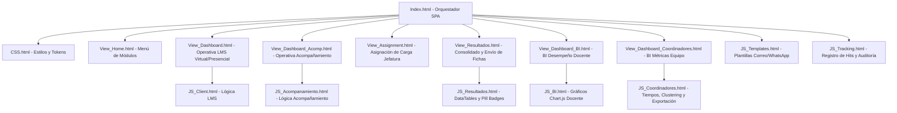

# Guía Maestra de Rutas, Arquitectura y Diagnóstico del Sistema
## Sistema de Monitoreo del Cumplimiento de Estándares de Calidad - USMP Virtual

> **Propósito de esta guía:**  
> Servir como manual de navegación técnica de referencia rápida y profunda para cualquier análisis, mantenimiento o extensión futura del código del sistema (tanto para desarrolladores como para asistentes de IA).

---

## 1. Mapa General del Ecosistema y Regla de Oro

El proyecto se encuentra dividido en dos entornos independientes alojados en el mismo repositorio:

```
c:\Proyectos  Antigravity\Sietama de monitoreo pregrado\
├── (Archivos raíz)                     ---> SISTEMA DE PREGRADO (Virtual + Presencial)
└── Posgrado - Sistema de monitoreo\    ---> SISTEMA DE POSGRADO (100% Virtual)
```

### Regla de Oro: Pregrado vs. Posgrado

| Dimensión | Sistema de Pregrado (Raíz) | Sistema de Posgrado (Subcarpeta) |
| :--- | :--- | :--- |
| **Ubicación** | Raíz del proyecto (`/`) | `/Posgrado - Sistema de monitoreo/` |
| **Alumnado / Modalidad** | **Virtual** Y **Presencial / Híbrida** | **100% Virtual** (Sin alumnos presenciales) |
| **Criterios aplicables** | `c_*` (Virtuales) y `cp_*` (Presenciales) | Exclusivamente `c_*` (Virtuales) |
| **Carga de Coordinadores** | Coordinadores tienen mix: ej. 5 virtuales + 1 presencial | Coordinadores tienen únicamente asignaturas virtuales |
| **Pestañas operativas LMS** | LMS Virtual + LMS Presencial | Exclusivamente LMS Virtual |

> [!IMPORTANT]
> **Nunca extrapolar la lógica de Presencial a Posgrado ni viceversa.**  
> Cuando se analicen porcentajes de avance de coordinadores (ej. 97.6% vs 100%), verificar siempre si el coordinador en cuestión tiene asignaturas de modalidad `PRESENCIAL`.

---

## 2. Mapa de Rutas de Archivos (Directory & File Manifest)

### 2.1. Backend: Controladores en Google Apps Script (`.gs`)

| Archivo | Responsabilidad Principal | Funciones Clave Expuestas | Hojas que Lee / Escribe |
| :--- | :--- | :--- | :--- |
| [`Code.gs`](file:///c:/Proyectos%20%20Antigravity/Sietama%20de%20monitoreo%20pregrado/Code.gs) | **Controlador Central y API RPC.** Gestiona autenticación, punto de entrada WebApp (`doGet`), filtrado por roles (Row-Level Security) y guardado transaccional con control de concurrencia. | `doGet(e)`<br>`getGlobalSessionData()`<br>`getInitialData(moduleKey)`<br>`saveGrade(...)`<br>`trackAccess(...)`<br>`trackInteraction(...)` | Lee: `Datos de los coordinadores`, `Asignación de coordinador`<br>Lee/Escribe: `LMS- virtual`, `LMS- presencial`, `Acompañamiento` |
| [`Backend_Coordinadores.gs`](file:///c:/Proyectos%20%20Antigravity/Sietama%20de%20monitoreo%20pregrado/Backend_Coordinadores.gs) | **BI del Equipo de Coordinación.** Analiza la metadata cruda de la Sábana General: calcula avance por semanas LMS ($W_0$ a Cierre) y Acompañamiento, tiempos netos mediante clustering de sesiones, auditorías ráfaga y fuera de plazo. | `getMetricasCoordinadores(forceSync)` | Lee: `Sábana General Docente`<br>Usa: `PropertiesService` (Caché 3 min) |
| [`Backend_BI.gs`](file:///c:/Proyectos%20%20Antigravity/Sietama%20de%20monitoreo%20pregrado/Backend_BI.gs) | **BI de Desempeño Docente.** Endpoint analítico para calcular promedios vigesimales, distribución por niveles (Muy Bueno, Bueno, Regular, Deficiente) y promedios por criterios. | `getSabanaBIData()` | Lee: `Sábana General Docente` |
| [`GeneradorBI.gs`](file:///c:/Proyectos%20%20Antigravity/Sietama%20de%20monitoreo%20pregrado/GeneradorBI.gs) | **Motor ETL / Data Mart.** Cruza Asignación + LMS Virtual/Presencial + Acompañamiento y genera la hoja consolidada de 72+ columnas con encabezados técnicos y títulos legibles. | `generarCabecerasSabanaGeneral()`<br>`sincronizarSabanaBI(silent)` | Escribe/Sincroniza: `Sábana General Docente` |
| [`GeneradorResultados.gs`](file:///c:/Proyectos%20%20Antigravity/Sietama%20de%20monitoreo%20pregrado/GeneradorResultados.gs) | **Consolidación de Resultados y Comunicaciones.** Sincroniza en memoria RAM la pestaña `Envío de resultados y fichas`, extrae criterios a mejorar y gestiona el envío masivo de correos oficiales. | `sincronizarResultadosGenerales(forceSync)`<br>`getConsolidatedData(forceSync)`<br>`sendBatchEmails(...)` | Lee/Escribe: `Envío de resultados y fichas` |
| [`GeneradorDoc.gs`](file:///c:/Proyectos%20%20Antigravity/Sietama%20de%20monitoreo%20pregrado/GeneradorDoc.gs) | **Automatización Documental (Google Docs API).** Clona plantillas oficiales de Drive (`TEMPLATE_ID_*`), reemplaza marcadores `{{c_1_1_pre}}` con regex y guarda la URL generada en la columna `Url_ficha`. | `generateDocVirtual(courseData)`<br>`generateDocPresencial(courseData)`<br>`generateDocAcomp(courseData)` | Lee datos del curso<br>Escribe URL en Google Sheets |
| [`Menu.gs`](file:///c:/Proyectos%20%20Antigravity/Sietama%20de%20monitoreo%20pregrado/Menu.gs) | **Menús de Hoja de Cálculo.** Crea los accesos directos en la barra superior de Google Sheets para sincronización manual y generación de cabeceras. | `onOpen()` | UI nativa de Google Sheets |

---

### 2.2. Frontend: Vistas y Controladores SPA (`.html`)

El frontend funciona como una **Single Page Application (SPA)** orquestada desde [`Index.html`](file:///c:/Proyectos%20%20Antigravity/Sietama%20de%20monitoreo%20pregrado/Index.html):



| Archivo HTML | Tipo | Descripción |
| :--- | :--- | :--- |
| [`Index.html`](file:///c:/Proyectos%20%20Antigravity/Sietama%20de%20monitoreo%20pregrado/Index.html) | Contenedor | Loader inicial de sesión, toast global, inclusión de todas las vistas y scripts mediante `<?!= include(...) ?>`. |
| [`CSS.html`](file:///c:/Proyectos%20%20Antigravity/Sietama%20de%20monitoreo%20pregrado/CSS.html) | Estilos | Tipografías, componentes UI, scrollbars estilizadas y paleta institucional USMP. |
| [`View_Home.html`](file:///c:/Proyectos%20%20Antigravity/Sietama%20de%20monitoreo%20pregrado/View_Home.html) | Vista | Selector de módulos para el usuario según su rol. |
| [`View_Dashboard.html`](file:///c:/Proyectos%20%20Antigravity/Sietama%20de%20monitoreo%20pregrado/View_Dashboard.html) | Vista | Tabla interactiva de asignaturas LMS (Virtual y Presencial), botones de calificación de 1 a 4 por criterio y semana. |
| [`View_Dashboard_Acomp.html`](file:///c:/Proyectos%20%20Antigravity/Sietama%20de%20monitoreo%20pregrado/View_Dashboard_Acomp.html) | Vista | Tabla de Acompañamiento Pedagógico con reloj/semáforo de 31 días y 11 criterios. |
| [`View_Assignment.html`](file:///c:/Proyectos%20%20Antigravity/Sietama%20de%20monitoreo%20pregrado/View_Assignment.html) | Vista | Módulo de Jefatura para repartir asignaturas a coordinadores de forma masiva con gráficos en `Chart.js`. |
| [`View_Resultados.html`](file:///c:/Proyectos%20%20Antigravity/Sietama%20de%20monitoreo%20pregrado/View_Resultados.html) | Vista | DataTables con pill badges, notas vigesimales consolidadas y modales de envío de resultados. |
| [`View_Dashboard_BI.html`](file:///c:/Proyectos%20%20Antigravity/Sietama%20de%20monitoreo%20pregrado/View_Dashboard_BI.html) | Vista | Dashboard analítico docente con gráficos doughnut y barras dinámicas por modalidad. |
| [`View_Dashboard_Coordinadores.html`](file:///c:/Proyectos%20%20Antigravity/Sietama%20de%20monitoreo%20pregrado/View_Dashboard_Coordinadores.html) | Vista | Dashboard de gestión del equipo: % avance por semana LMS/Acomp, tiempos de auditoría, exportación a Excel y PDF. |

---

## 3. Diccionario Técnico de Criterios y Matriz por Semanas

### 3.1. Convenciones de Nombres en Base de Datos

* **`c_*`**: Criterio de modalidad **Virtual** (ej. `c_1_1_pre`, `c_3_1_s1`, `c_4_1_s2`).
* **`cp_*`**: Criterio de modalidad **Presencial** (ej. `cp_1_1_pre`, `cp_3_2_s2`, `cp_8_1_s4`).
* **`*_ts`**: Marca de tiempo (Timestamp) asociada a la primera vez que se calificó ese criterio.
* **`hits_s*_ap` / `hits_s*_usmp`**: Contador de ingresos a las plataformas Aula Principal / USMP por semana.
* **`audit_time_s*` / `audit_burst5_s*`**: Auditoría de tiempo de revisión y ráfagas rápidas de guardado.
* **`A_C*`, `B_C*`, `C_C*`**: Criterios de **Acompañamiento Pedagógico** (11 criterios).

---

### 3.2. Matriz Comparativa de Criterios LMS (Virtual vs. Presencial)

Esta matriz es el núcleo de evaluación semanal:

| Semana / Bloque | Criterios Virtuales (`c_*`) | Criterios Presenciales (`cp_*`) | Total Criterios | Diferencias Clave |
| :--- | :--- | :--- | :---: | :--- |
| **Semana 0 (Bienvenida / Pre)** | `c_1_1_pre`<br>`c_2_1_b`<br>`c_2_2_b` | `cp_1_1_pre`<br>`cp_2_1_b`<br>`cp_2_2_b` | **3 vs 3** | Idénticos en estructura: Actualización de OVA y formatos institucionales de inicio. |
| **Semana 1 (Unidad I)** | `c_1_2_s1`<br>`c_2_1_s1`<br>`c_2_2_s1`<br>`c_3_1_s1` *(Tutoría)*<br>`c_4_1_s1`<br>`c_4_2_s1`<br>`c_5_1_s1`<br>`c_6_1_s1` | `cp_1_2_s1`<br>`cp_2_1_s1`<br>`cp_2_2_s1`<br>`cp_3_1_s1` *(E. a imprimir)*<br>`cp_5_1_s1`<br>`cp_5_2_s1`<br>`cp_6_1_s1`<br>`cp_7_1_s1` | **8 vs 8** | Virtual evalúa tutoría online; Presencial evalúa entrega de exámenes impresos. |
| **Semana 2 (Unidad II)** | `c_2_1_s2`<br>`c_2_2_s2`<br>`c_3_1_s2` *(Tutoría)*<br>`c_4_1_s2`<br>`c_4_2_s2`<br>`c_5_1_s2`<br>`c_6_1_s2` | `cp_2_1_s2`<br>`cp_2_2_s2`<br>`cp_3_2_s2` *(E. Parcial)*<br>`cp_5_1_s2`<br>`cp_5_2_s2`<br>`cp_6_1_s2`<br>`cp_7_1_s2` | **7 vs 7** | **Punto Crítico:** En Presencial se evalúa `cp_3_2_s2` (Examen Parcial). Su timestamp en la Sábana mapea a `c_3_1_s2_ts`. |
| **Semana 3 (Unidad III)** | `c_2_1_s3`<br>`c_2_2_s3`<br>`c_3_1_s3` *(Tutoría)*<br>`c_4_1_s3`<br>`c_4_2_s3`<br>`c_5_1_s3`<br>`c_6_1_s3` | `cp_2_1_s3`<br>`cp_2_2_s3`<br>`cp_5_1_s3`<br>`cp_5_2_s3`<br>`cp_6_1_s3`<br>`cp_7_1_s3` | **7 vs 6** | En Presencial no hay tutoría virtual ni examen parcial en S3; tiene 6 criterios. |
| **Semana 4 y Cierre (Unidad IV)** | `c_2_1_s4`<br>`c_2_2_s4`<br>`c_3_1_s4`<br>`c_4_1_s4`<br>`c_4_2_s4`<br>`c_5_1_s4`<br>`c_6_1_s4`<br>`c_7_1_s4` *(Cierre)* | `cp_2_1_s4`<br>`cp_2_2_s4`<br>`cp_3_3_s4` *(E. Final)*<br>`cp_4_1_s4` *(Inasistencias)*<br>`cp_5_1_s4`<br>`cp_5_2_s4`<br>`cp_6_1_s4`<br>`cp_7_1_s4`<br>`cp_8_1_s4` *(Cierre)*<br>`cp_8_2_s4` *(Informes)* | **8 vs 10** | Presencial incluye entrega de Examen Final (`cp_3_3_s4`), inasistencias (`cp_4_1_s4`) e informes (`cp_8_2_s4`). |

---

### 3.3. Criterios de Acompañamiento Pedagógico (11 Criterios)

Divididos en 3 dimensiones pedagógicas (Escala del 1 al 4, convertida a escala vigesimal Base 20):

* **Dimensión A: Inicio (3 criterios)**
  * `A_C01_OBJ`: 1. Presenta los objetivos y resultados de aprendizaje.
  * `A_C02_SAB`: 2. Recupera saberes previos y estimula la motivación.
  * `A_C03_CCO`: 3. Genera conflicto cognitivo o problematización.
* **Dimensión B: Desarrollo (6 criterios)**
  * `B_C04_CON`: 4. Domina y explica con claridad los contenidos.
  * `B_C05_APL`: 5. Propone aplicaciones prácticas y casos reales.
  * `B_C06_EST`: 6. Aplica estrategias didácticas activas y participativas.
  * `B_C07_REC`: 7. Emplea recursos tecnológicos y materiales adecuados.
  * `B_C08_COM`: 8. Mantiene una comunicación asertiva y respetuosa.
  * `B_C09_CAP`: 9. Fomenta el desarrollo de capacidades cognitivas superiores.
* **Dimensión C: Cierre (2 criterios)**
  * `C_C10_EVA`: 10. Realiza evaluación formativa y retroalimentación.
  * `C_C11_EXT`: 11. Promueve actividades de extensión y transferencia.

---

## 4. Estructura de la Base de Datos (Google Sheets)

### 4.1. Catálogo de Hojas del Libro

1. **`Asignación de coordinador`**: Matriz maestra de carga docente y vinculación con coordinadores.
2. **`Sistema de gestión del aprendizaje (LMS)- virtual`**: Notas y marcas de tiempo de cursos virtuales.
3. **`Sistema de gestión del aprendizaje (LMS)- presencial`**: Notas y marcas de tiempo de cursos presenciales.
4. **`Acompañamiento del desempeño Pedagógico`**: Evaluaciones pedagógicas de 11 criterios.
5. **`Datos de los coordinadores`**: Tabla de usuarios, correos institucionales UVA y roles (`Admin`, `Jefe de área`, `Coordinador`).
6. **`Sábana General Docente`**: Data Mart de 72+ columnas generado por `GeneradorBI.gs` para los módulos de Business Intelligence.
7. **`Envío de resultados y fichas`**: Consolidado de notas vigesimales, enlaces a Google Docs generados y estatus de notificación a docentes.

---

### 4.2. Estructura de Filas y Columnas Clave

> [!NOTE]
> **Regla de 3 Filas en Hojas Operativas y Sábana:**
> * **Fila 1:** Códigos técnicos normalizados en minúsculas (ej. `c_1_1_pre`, `hits_s1_ap`).
> * **Fila 2:** Títulos descriptivos para visualización humana.
> * **Fila 3 en adelante:** Registros de datos reales (una fila por asignatura/docente).

#### Columnas Base Fundamentales (0-based / Letra de Columna)

* **Col C (Índice 2):** `Programa Institucional` (ej. Medicina, Derecho, etc.).
* **Col D (Índice 3):** `Modalidad` (`VIRTUAL` o `PRESENCIAL`).
* **Col E (Índice 4):** `Asignatura` (Nombre de la materia).
* **Col G (Índice 6):** `Docente` (Nombre completo del profesor).
* **Col N (Índice 13):** `Tipo de Metodología` (Puede ser `Híbrida`).
* **Col R (Índice 17):** `Asignación de COORDINADOR ACADÉMICO` (Nombre del coordinador).
* **Col S (Índice 18):** `Correo UVA` (Email institucional del coordinador para **Row-Level Security**).
* **Col T (Índice 19):** `Periodo fecha` / Fecha de inicio (`dd/mm/yyyy`). Vital para el cálculo de semanas transcurridas y semáforos.

---

## 5. Algoritmos Clave del Sistema

### 5.1. Algoritmo de Tiempos y Sesiones de Coordinadores (Clustering)

En [`Backend_Coordinadores.gs`](file:///c:/Proyectos%20%20Antigravity/Sietama%20de%20monitoreo%20pregrado/Backend_Coordinadores.gs), para evitar inflar el tiempo de dedicación si el coordinador deja la pestaña abierta:

1. Se ordenan cronológicamente todos los timestamps válidos registrados por el coordinador.
2. Si el intervalo entre dos marcas consecutivas $\Delta t \le 20\text{ min}$:
   $$\text{Tiempo acumulado} += \Delta t$$
3. Si el intervalo está en pausa intermedia ($20 < \Delta t \le 30\text{ min}$):
   $$\text{Tiempo acumulado} += 2\text{ min (tiempo base de cambio de bloque)}$$
4. Si el intervalo es tiempo muerto ($> 30\text{ min}$):
   Se descarta el lapso y se inicia una nueva sesión sumando $2\text{ min}$ de arranque.

### 5.2. Conversión Vigesimal Dinámica (Base 20)

En Acompañamiento Pedagógico:
$$\text{Promedio} = \frac{\sum \text{Notas registradas}}{\text{Criterios evaluados}}$$
$$\text{Nota Vigesimal} = \text{Promedio} \times 5$$

> [!TIP]
> **Exclusión de no evaluados:** El divisor es estrictamente el número de criterios calificados ($> 0$), nunca 11 de forma fija, evitando perjudicar a docentes en proceso de evaluación parcial.

---

## 6. Guía Rápida de Diagnóstico y Resolución de Problemas (Troubleshooting)

### Caso 1: Un coordinador sale al 97.6% (o menos) en Unidad II cuando completó todo al 100%

* **Síntoma:** Yesenia sale al 100%, pero Mónica, Luis, María Isabel o Christian salen al 97.6%.
* **Causa Raíz:** El coordinador tiene 1 asignatura `PRESENCIAL`. En la Semana 2 (Unidad II), la asignatura presencial tiene el criterio `cp_3_2_s2`. Si el algoritmo solo busca códigos virtuales (`c_3_1_s2`), la materia presencial queda con 6/7 criterios evaluados ($85.71\%$), produciendo:
  $$\frac{5 \times 100\% + 85.71\%}{6} = 97.62\% \approx 97.6\%$$
* **Solución:** Verificar que en [`Backend_Coordinadores.gs`](file:///c:/Proyectos%20%20Antigravity/Sietama%20de%20monitoreo%20pregrado/Backend_Coordinadores.gs) se lean directamente las notas registradas desde `idxCriteriaLms` filtrando por modalidad (`modalidad === 'PRESENCIAL'` evalúa `cp_*` e ignora `c_3_1_s*`).

---

### Caso 2: Los cambios de notas no se reflejan en el Dashboard BI

* **Síntoma:** El coordinador guardó notas en la WebApp, pero el Dashboard BI o de Coordinadores muestra datos antiguos.
* **Causa Raíz:** Mecanismo de optimización de RAM y cuotas de Google Sheets:
  * [`Backend_Coordinadores.gs`](file:///c:/Proyectos%20%20Antigravity/Sietama%20de%20monitoreo%20pregrado/Backend_Coordinadores.gs) tiene un caché de 3 minutos (`LAST_BI_SYNC` en `PropertiesService`).
* **Solución:** Pasar `forceSync = true` al ejecutar la función, o hacer clic en el botón de sincronización forzada en el menú de la hoja: **"(BI) Sincronizar Sábana General Docente"**.

---

### Caso 3: "Acceso Restringido" o Pantalla en Blanco al Iniciar Sesión

* **Síntoma:** El usuario ingresa a la URL de la WebApp pero recibe error de autorización.
* **Causa Raíz:** El correo de la cuenta de Google activa no coincide exactamente con el listado en la hoja `Datos de los coordinadores` (columna de Email) ni con la Columna S de asignación.
* **Solución:** Verificar en la hoja `Datos de los coordinadores` que el email esté registrado sin espacios adicionales al inicio o final y con el rol adecuado (`Admin`, `Jefe de área`, `Coordinador`).

---

### Caso 4: "No se pudo obtener el bloqueo de script (LockService timeout)"

* **Síntoma:** Al guardar notas masivas o sincronizar hojas, el script lanza excepción de bloqueo.
* **Causa Raíz:** Múltiples usuarios escribiendo concurrentemente mientras se ejecuta una sincronización pesada.
* **Solución:** Las llamadas transaccionales (`saveGrade`, `generarCabecerasSabanaGeneral`) utilizan cerrojos temporales de 10,000 a 30,000 ms (`lock.waitLock(30000)`). El frontend maneja reintentos automáticos tras 2 segundos.

---

## 7. Checklist para Futuros Análisis de Código

Antes de realizar modificaciones en el sistema, siga este orden de verificación:

1. [ ] **¿Es Pregrado o Posgrado?** Identificar el directorio de trabajo exacto.
2. [ ] **¿Afecta la Sábana General?** Si se agregan criterios o columnas, actualizar `GeneradorBI.gs` y luego ejecutar `generarCabecerasSabanaGeneral()`.
3. [ ] **¿Afecta la lectura de índices?** Verificar si el código usa `findCol(code)` o índices duros. Priorizar siempre búsqueda dinámica por código de cabecera (Fila 1).
4. [ ] **¿Involucra modalidades?** Verificar siempre cómo responde la lógica ante cursos `PRESENCIAL`, `VIRTUAL` e `HÍBRIDA`.
5. [ ] **¿Conserva LockService?** Asegurar que cualquier función de escritura mantenga el cerrojo de script para prevenir corrupción por concurrencia.
